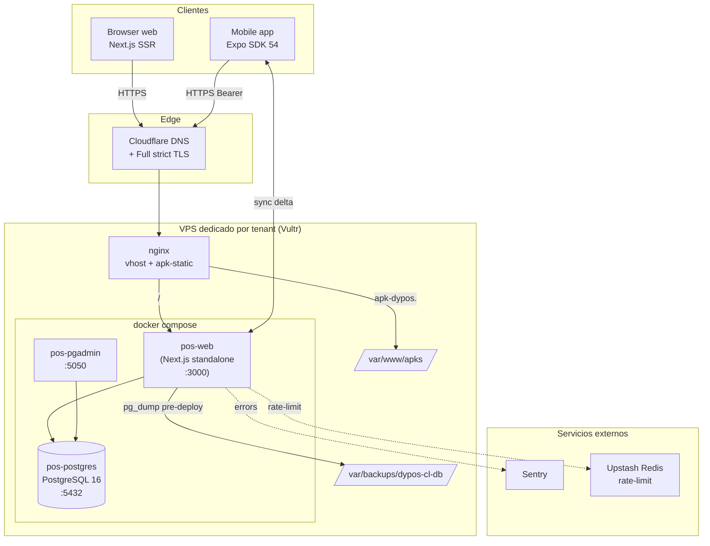

# Arquitectura oficial — DyPos CL

> **Producto:** DyPos CL — POS-as-a-Service para PYMEs chilenas
> **Owner:** Pierre Benites Solier · Dyon Labs
> **Modelo SaaS:** Camino C — deployment dedicado por cliente (un VPS / un dominio / una BD por tenant)
> **Estado:** Fase 1 cerrada (Arquitectura Oficial · 2026-04-29)
> **Fuente de verdad de estado vivo:** `memory/projects/pos-chile-monorepo.md`

Este documento describe la arquitectura técnica oficial del producto. Todos los
agentes (Claude Code Worktree / CLI, Codex, Pierre) deben consultarlo antes de
introducir cambios estructurales. Los cambios a la arquitectura se registran en
`decision-log.md` como ADRs.

## 1. Visión técnica de alto nivel

DyPos CL es un sistema operativo de pequeño comercio compuesto por:

- **Web** — Next.js 15 App Router (SSR + Server Actions + API REST v1)
- **Mobile** — Expo SDK 54 (React Native 0.81) con sync offline-first
- **API REST v1** — `/api/v1/*` para mobile y futuras integraciones
- **Base de datos** — PostgreSQL 16 con Prisma 6 (24 modelos, soft-delete + AuditLog)
- **Infra** — Docker Compose (web + postgres + pgadmin) en VPS Vultr
- **Auth** — NextAuth v5 (cookies en web · JWT Bearer en mobile)
- **Observabilidad** — Sentry + healthchecks + auditoría aplicativa



## 2. Mapa de carpetas (alto nivel)

```
system_pos/
├── apps/
│   ├── web/                  # Next.js 15 — admin + caja + reportes
│   │   ├── app/
│   │   │   ├── (dashboard)/  # ventas, caja, productos, reportes, ...
│   │   │   ├── api/v1/       # API REST pública (Bearer auth)
│   │   │   ├── api/auth/     # NextAuth v5 handlers
│   │   │   └── api/health/   # liveness probe
│   │   └── auth.ts           # NextAuth config (Node)
│   └── mobile/               # Expo SDK 54
│       ├── app/              # expo-router (file-based)
│       ├── stores/           # zustand: auth, cart, sync
│       ├── db/               # SQLite (drizzle) offline cache
│       └── lib/              # versión, helpers
├── packages/
│   ├── db/                   # Prisma client + schema + migrations
│   ├── domain/               # Zod schemas + tipos compartidos
│   ├── api-client/           # cliente HTTP tipado (mobile + tests)
│   ├── ui/                   # shadcn/ui shared (web)
│   └── typescript-config/    # tsconfig base
├── scripts/
│   ├── deploy.sh             # deploy oficial — único camino a prod
│   ├── provision-tenant.sh   # provision SaaS dedicado
│   ├── backup-project.sh     # snapshot del repo
│   ├── mobile-build-apk.sh   # build APK release
│   └── mobile-publish-release.sh  # publica APK al server
├── docs/
│   ├── architecture/         # ESTE doc — fuente oficial
│   ├── adr/                  # ADRs históricos
│   ├── audits/               # audits previos (SUPERSEDED)
│   ├── m7-runbook.md         # runbook ops
│   └── mobile-release-runbook.md
├── memory/                   # segundo cerebro (Claude)
└── docker-compose.yml
```

## 3. Documentos de arquitectura

| Doc | Cubre |
|-----|-------|
| `frontend.md` | Next.js App Router, Server/Client Components, Tailwind v4, shadcn/ui |
| `backend.md` | Server Actions, API v1 REST, NextAuth, contratos Zod, rate-limit |
| `database.md` | Prisma schema (24 modelos), soft-delete, AuditLog, migrations, índices |
| `mobile.md` | Expo SDK 54, expo-router, NativeWind, stores zustand, sync offline |
| `deploy-ops.md` | `scripts/deploy.sh`, backups auto, rollback, smoke prod |
| `tenant-provisioning.md` | SaaS dedicado: `provision-tenant.sh`, DNS, SSL, primer login |
| `testing-ci.md` | Vitest (web) + Jest (mobile) + GitHub Actions CI |
| `decision-log.md` | ADRs vigentes + decisiones pendientes (`DECISION_REQUIRED`) |

## 4. Principios arquitectónicos

1. **Type safety end-to-end** — Zod en domain, Prisma generado, tipos compartidos
   en `@repo/domain` consumidos por web y mobile.
2. **Server Actions first en web** — sólo se exponen como API REST `/api/v1/*`
   las operaciones que mobile necesita. Cualquier mutación crítica corre en
   `prisma.$transaction`.
3. **Soft-delete + AuditLog** — `deletedAt` en modelos críticos
   (Venta, Producto, Cliente, Devolucion); cada mutación deja huella en
   `AuditLog`. Reportes y queries filtran por `deletedAt = null` por defecto.
4. **Mobile offline-first** — SQLite local (drizzle) cachea catálogo;
   `syncStore` empuja deltas con backoff exponencial. JWT Bearer (no cookies).
5. **Deploy reproducible** — un único camino: `./scripts/deploy.sh`. Cero `ssh`
   manual a prod, cero `docker compose up` sin `--force-recreate`.
6. **Tenancy dedicada (Camino C)** — un cliente = un VPS = una BD = un dominio.
   Sin acoplamiento de datos entre tenants. Migración a multi-tenant lógica está
   evaluada en `docs/adr/002-multi-tenant-future-migration.md`.
7. **Audit trail transparente** — todo cambio destructivo (eliminar/restaurar
   ventas, devoluciones) deja registro inmutable; admins ven historial.

## 5. Tecnologías y versiones (resumen)

| Capa | Tecnología | Versión |
|------|-----------|---------|
| Monorepo | Turborepo | 2.5.x (`tasks`, no `pipeline`) |
| Package mgr | pnpm | 10.6.0 |
| Web framework | Next.js | 15.3.x — App Router + Turbopack |
| CSS web | Tailwind CSS | v4.2.x — CSS-native |
| UI web | shadcn/ui | new-york style |
| Mobile | Expo / RN | SDK 54 / 0.81 |
| CSS mobile | NativeWind | 4.2.3 |
| ORM | Prisma | 6.x |
| DB | PostgreSQL | 16-alpine |
| Auth | NextAuth | 5.0.0-beta.31 (JWT) |
| Lenguaje | TypeScript | 5.8.x strict |
| Tests web | Vitest | latest |
| Tests mobile | Jest + jest-expo | latest |

> Para el detalle exhaustivo ver `memory/context/stack-tech.md`.

## 6. Cómo navegar este manual

- ¿Vas a tocar UI web? → `frontend.md` + `backend.md` (Server Actions).
- ¿Vas a tocar API mobile o externa? → `backend.md` (API v1) + `mobile.md`.
- ¿Vas a cambiar el schema? → `database.md` + crear migration + abrir ADR.
- ¿Vas a deployar? → `deploy-ops.md` (estrictamente).
- ¿Vas a onboardar un cliente? → `tenant-provisioning.md`.
- ¿No estás seguro si una decisión ya se tomó? → `decision-log.md`.

## 7. Tareas Pierre vs agentes

| Tarea | Quién |
|-------|-------|
| Aprobar ADRs y decisiones de producto | **Pierre** |
| Provisionar VPS y DNS de tenants nuevos | **Pierre** (con script) |
| Tocar `.env.docker` en VPS | **Pierre** únicamente |
| Rotar `NEXTAUTH_SECRET` o credenciales | **Pierre** |
| Implementar features y tests | Agentes (Worktree / CLI) |
| Ejecutar deploy.sh tras commits | Agentes con confirmación de Pierre |
| Auditorías y verificación cruzada | Codex (agente auditor) |

## 8. Cambios a la arquitectura

Cualquier cambio estructural (nueva tecnología, nuevo paquete, cambio de
deployment model, schema breaking change) requiere:

1. ADR nuevo en `docs/adr/NNN-titulo.md` (numeración correlativa).
2. Mención en `decision-log.md`.
3. Aprobación explícita de Pierre.
4. Actualización del doc relevante en `docs/architecture/`.

---

_Última actualización: 2026-04-29 — Fase 1 cerrada._
