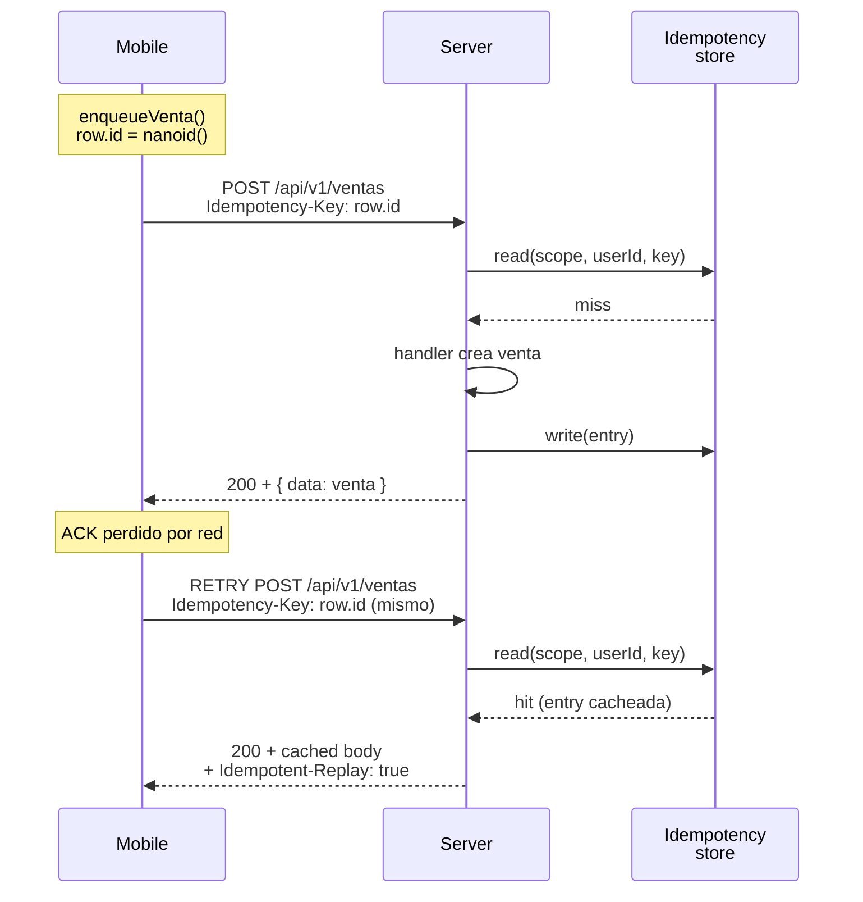

# Backend — Server Actions + API REST v1 + Auth

> **App:** `apps/web/`
> **Stack:** Next.js 15 (Node runtime) + Prisma 6 + NextAuth v5 + Upstash rate-limit + Sentry

El backend de DyPos CL vive dentro de `apps/web`. Hay dos superficies de
mutación bien diferenciadas:

1. **Server Actions** — consumidas por el propio frontend (RSC).
2. **API REST `/api/v1/*`** — consumida por mobile y futuras integraciones.

Ambas comparten la lógica de dominio (`packages/domain`) y el cliente Prisma
(`packages/db`).

## 1. Server Actions

Ubicación canónica: `apps/web/app/(dashboard)/<modulo>/actions.ts`.

Módulos con actions:

- `caja/actions.ts` — abrir/cerrar caja, registrar movimiento.
- `categorias/actions.ts`
- `clientes/actions.ts`
- `dashboard/actions.ts` — KPIs y top productos.
- `devoluciones/actions.ts` — `crearDevolucion`.
- `productos/actions.ts`
- `usuarios/actions.ts`
- `ventas/actions.ts` — `crearVenta`, `editarVenta`, `eliminarVenta`, `restaurarVenta`.

Pattern: ver `frontend.md §3`. Reglas duras:

- `await auth()` al inicio.
- Validación Zod (schemas en `@repo/domain`).
- Respuesta tipada `{ ok: true, ... } | { ok: false, error: string }`.
- Mutaciones críticas en `prisma.$transaction`.
- AuditLog write dentro de la transacción cuando aplica.

### Invariante crítica de ventas

```
total === sum(PagoVenta.monto)
```

Cualquier action que crea/edita ventas DEBE garantizar esto. La regresión que
detectó Codex en `editarVenta` (Fase 0.1) violaba este invariante con split
tender — fix en commit `ba2ec6b`, regression tests en
`apps/web/app/(dashboard)/ventas/__tests__/editarVenta.test.ts`.

### Stock + contadores

```
crearVenta:    stock -= n,  ventas += n,  compras += 1,  ultimaCompra = now()
eliminarVenta: stock += n,  ventas -= n,  compras -= 1,  ultimaCompra = MAX(historial restante)
editarVenta:   revertir vieja + aplicar nueva (todo en una $transaction)
```

`ultimaCompra` al eliminar NO se asume "venta anterior" — se recalcula buscando
`MAX(fecha)` del historial restante del cliente.

## 2. API REST v1

Base path: `/api/v1/`. Auth: **JWT Bearer** (no cookies). Rate-limit: Upstash.

Inventario actual:

```
POST   /api/v1/auth/login              → emite JWT (mobile login)
GET    /api/v1/usuarios/me             → perfil sesión
PATCH  /api/v1/usuarios/me/password    → cambio password
GET    /api/v1/productos               → catálogo (cache mobile)
GET    /api/v1/productos/[id]
GET    /api/v1/categorias
GET    /api/v1/clientes
GET    /api/v1/clientes/[id]
GET    /api/v1/ventas
POST   /api/v1/ventas                  → crear venta desde mobile
GET    /api/v1/ventas/[id]
GET    /api/v1/devoluciones
POST   /api/v1/devoluciones
GET    /api/v1/devoluciones/[id]
GET    /api/v1/dashboard               → KPIs read-only
GET    /api/v1/caja/aperturas
POST   /api/v1/caja/aperturas
GET    /api/v1/caja/aperturas/activa
GET    /api/v1/caja/aperturas/[id]
POST   /api/v1/caja/aperturas/[id]/movimientos
```

Otras rutas no-versionadas:

- `GET /api/health` — liveness probe usado por Docker y `deploy.sh`.
- `GET /api/docs`, `GET /api/docs/spec` — Scalar API reference + OpenAPI JSON.
- `GET /api/mobile/manifest` — release info de la APK pública.
- `POST /api/perfil/avatar` — upload base64.
- `GET /api/reportes/excel` — exporta XLSX con filtros de fecha.
- `/api/auth/[...nextauth]` — handlers NextAuth (cookies web).

### Pattern API route (Fase 2B-P0)

```ts
// apps/web/app/api/v1/ventas/route.ts
import {
  requireAuth,
  requireRateLimit,
  jsonError,
  jsonZodError,
  withIdempotencyResponse,
} from "../_helpers";

export async function POST(request: Request) {
  const limited = await requireRateLimit(request);
  if (limited) return limited;

  const { session, error } = await requireAuth(request);
  if (error) return error;

  // Body NO JSON parseable → 400 (cliente roto).
  let body: unknown;
  try { body = await request.json(); }
  catch { return jsonError("Body JSON inválido", 400, { code: "VALIDATION_FAILED" }); }

  // JSON válido + reglas Zod → 422 con details estructurado preservando issues.
  const parsed = CreateVentaSchema.safeParse(body);
  if (!parsed.success) return jsonZodError(parsed.error);

  const usuarioId = Number(session.user.id);

  // Idempotency wrapper — dedupe automático por Idempotency-Key.
  return withIdempotencyResponse(
    request,
    "venta:create",
    usuarioId,
    () => createVenta({ ...parsed.data, usuarioId }),
  );
}

// Lógica core retorna { status, body } para que el wrapper la envuelva
// en NextResponse con headers de idempotency apropiados.
async function createVenta(args: { ... }): Promise<{ status: number; body: unknown }> {
  // ...negocio...
  return { status: 200, body: { data: result } };
}
```

Reglas:

- Bearer obligatorio (excepto `/auth/login` y `/health`).
- Validación Zod con schemas compartidos con web.
- Códigos HTTP semánticos: 200/201/400/401/403/404/409/422/429/500/503.
- Lógica de negocio extraída a función inner (`createVenta`) que retorna
  `{ status, body }` — habilita idempotency wrapping.

### Envelope estándar (Fase 2B-P0)

**Éxito:**
```json
{ "data": <T>, "meta?": { "page": 1, "total": 42 } }
```

**Error:**
```json
{
  "error": "Mensaje legible en español",
  "code?": "VALIDATION_FAILED" | "BUSINESS_RULE" | "DUPLICATE" | ...,
  "details?": { "issues": [{ "path": [...], "message": "...", "code": "..." }] }
}
```

Reglas:

- `error` siempre presente (backwards compat).
- `code` opcional pero recomendado para que clientes discriminen sin parsear strings.
- `details` para Zod preserva `issues[]` estructurado (NO string aplanado).
- Helper canónico: `jsonError(message, status?, { code?, details?, headers? })`.
- Helper Zod: `jsonZodError(zodError, status = 422)` — auto-emite `code:
  "VALIDATION_FAILED"` + `details.issues[]`.

### Códigos de error (`ApiErrorCode`)

| Code | Status típico | Cuándo |
|------|---------------|--------|
| `VALIDATION_FAILED` | 400 (body malformado) o 422 (Zod fail) | Body no JSON, schema fail, tipo inválido. |
| `BUSINESS_RULE` | 422 | Caja cerrada, suma pagos != total, monto recibido < efectivo. |
| `DUPLICATE` | 409 | RUT/código de barras ya existe. |
| `CONFLICT` | 409 | Stock insuficiente, producto inactivo, estado conflictivo. |
| `NOT_FOUND` | 404 | Recurso ausente o soft-deleted. |
| `UNAUTHORIZED` | 401 | Sin token o token inválido. |
| `FORBIDDEN` | 403 | Token válido pero rol no autorizado. |
| `RATE_LIMITED` | 429 | Cliente excedió bucket. Header `Retry-After`. |
| `UNAVAILABLE` | 503 | Upstash/downstream caído. Header `Retry-After`. |
| `INTERNAL_ERROR` | 500 | Bug del server. Reportado a Sentry. |

### Status code matrix

| Situación | Status | Code |
|-----------|--------|------|
| Body no es JSON | 400 | `VALIDATION_FAILED` |
| JSON válido, Zod fail | 422 | `VALIDATION_FAILED` |
| Sin auth | 401 | `UNAUTHORIZED` |
| Auth OK pero sin rol | 403 | `FORBIDDEN` |
| Recurso ausente | 404 | `NOT_FOUND` |
| RUT/código barras duplicado | 409 | `DUPLICATE` |
| Stock insuficiente / producto inactivo | 409 | `BUSINESS_RULE` |
| Caja cerrada / regla negocio | 422 | `BUSINESS_RULE` |
| Rate limit excedido | 429 | `RATE_LIMITED` (`Retry-After: 60`) |
| Upstash/downstream caído | 503 | `UNAVAILABLE` (`Retry-After: 5`) |
| Bug server | 500 | `INTERNAL_ERROR` |

### Idempotency (Fase 2B-P0 · `POST /api/v1/ventas`)

**Problema:** mobile `syncStore` reintenta con backoff exponencial tras
error de red. Si la primera ejecución creó la venta en el server pero el
ACK se perdió, el retry duplica la venta — daño contable directo.

**Solución:** header `Idempotency-Key: <string>` (RFC draft-ietf-httpapi-
idempotency-key). El server cachea la primera response y los retries
con la misma key reciben la misma response sin re-ejecutar la mutación.

**Flujo:**



**Reglas (header tri-estado):**

- **Ausente** → ejecución directa, sin dedupe (graceful degradation
  pre-2B mobile).
- **Válido** (`^[A-Za-z0-9_\-]{1,200}$`) → dedupe activo. Scope aísla
  buckets por endpoint (hoy `"venta:create"`; futuro: `"devolucion:create"`,
  `"movimiento:create"`, ...). userId en la key previene que un cajero
  "robe" la cache de otro.
- **Inválido** (whitespace, símbolos prohibidos, vacío tras trim,
  >200 chars) → **400 + `VALIDATION_FAILED` + `details: { header:
  "Idempotency-Key" }`**. Crítico: NO degradar silenciosamente a "sin
  dedupe" porque el cliente cree estar protegido; mejor fallar ruidoso.

**Cacheo y replay:**

- Status < 500 se cachea (incluyendo 4xx negocio — errores
  determinísticos por la misma key).
- Status 5xx NO se cachea (errores transientes server deben permitir retry).
- Cache TTL: 24h (alcanza para reconnect mobile post-suspensión).
- Header de respuesta `Idempotent-Replay: true` cuando sirve desde cache.

**Fingerprint del payload (patch Fase 2B-P0):**

Para detectar reuse de la misma key con body distinto (bug clásico:
cliente cambia el body "mejorando" la operación pero olvida regenerar
la key):

- El handler calcula `computeFingerprint(body)` (SHA-256 del JSON
  canónico — keys ordenadas alfabéticamente; arrays mantienen orden).
- Se guarda `fingerprint` junto a la entry cacheada.
- En cache hit:
  - **Mismo fingerprint** → replay normal (200 cacheado).
  - **Fingerprint distinto** → **409 + `CONFLICT` + error
    "Idempotency-Key reutilizado con un payload distinto"** sin
    re-ejecutar el handler.
- Entries pre-Fase-2B-P0 (sin fingerprint) → replay sin comparación
  (compat hacia atrás).
- Order-independent: `{ items, metodoPago }` y `{ metodoPago, items }`
  con mismos valores → mismo fingerprint.

**Mobile (sync.ts):** usa `row.id` (nanoid 21 chars persistido en
`sync_queue`) como `Idempotency-Key`. Mismo id en todos los retries de
una fila.

### Limitaciones de idempotency

**Backend store:**

- **Con Upstash Redis** (`UPSTASH_REDIS_REST_URL` + `_TOKEN`): garantía
  fuerte. Distribuido entre instancias. SETNX atómico evita race
  conditions.
- **Sin Upstash** (dev/CI/prod sin config): fallback a memoria
  in-process. Garantía DÉBIL — si el proceso reinicia (crash, deploy,
  scale), las keys se pierden y un retry mobile post-reinicio puede
  duplicar la venta. Documentado como degradación intencional.

**In-flight lock (concurrencia):**

- Dos requests con misma key llegando en paralelo: el primero adquiere
  el lock, el segundo espera con polling hasta 5s a que aparezca la
  cache, luego sirve la response cacheada.
- Si el lock vence sin que aparezca cache (caso raro: red excepcional-
  mente lenta + timeout interno), el segundo continúa como si fuera
  el primero — duplicación posible. Documentado.

**Si en futuro se requiere persistencia fuerte sin Upstash:** abrir un
ADR en `docs/adr/` con un mini-diseño de tabla `IdempotencyKey` en
Prisma (modelo, TTL, scope, response cache, race lock, migración,
tests). NO migrar DB sin ese diseño aprobado por Pierre.

### Excepción documentada — `POST /api/v1/auth/login`

Único endpoint REST sin envelope `{ data }`. Devuelve directamente el
shape de `LoginResponseSchema`:

```json
{ "token": "<jwt>", "user": { "id", "email", "nombre", "rol" } }
```

**Razón:** mobile (`apps/mobile/stores/authStore.ts`) ya consume este
shape directo. Cambiar a `{ data: { token, user } }` rompería compat
binaria con la APK desplegada. Mantener el shape como excepción y
documentarlo aquí.

## 3. Auth — NextAuth v5

Archivos:

- `auth.ts` — config Node, exporta `{ auth, handlers, signIn, signOut }`.
- `auth.config.ts` — config edge-safe, usado por middleware.
- `middleware.ts` — `export const { auth: middleware } = NextAuth(authConfig)`.
- `auth-types.d.ts` — augmentación tipos (NO `next-auth.d.ts`, shadow).

Estrategia: **JWT** (no DB sessions) con `PrismaAdapter`. Cookies en web,
Bearer en mobile (mismo secret, distinta forma de leer).

### Roles

- `ADMIN` — full acceso.
- `CAJERO` — caja + ventas + devoluciones; sin `/usuarios`, sin `/reportes`
  destructivos, sin `/dashboard` (RBAC verificado en smoke prod 2026-04-30).

Cast obligatorio (bug v5 beta): `token.rol as Session["user"]["rol"]`.

## 4. Rate limiting

`@upstash/ratelimit` + `@upstash/redis`. Configurado en `lib/api/rate-limit.ts`.
Aplicado a todas las rutas `/api/v1/*` y `/api/auth/*`. Si el env var Upstash
no está seteada en CI/dev, el limiter degrada a no-op (no rompe builds).

## 5. Validación y contratos compartidos

Todos los schemas Zod viven en `packages/domain/src/`:

- `venta.ts`, `producto.ts`, `cliente.ts`, `categoria.ts`, `usuario.ts`,
  `caja.ts`, `devolucion.ts`, `pago.ts`, ...

Mobile usa los mismos schemas vía `@repo/api-client` para validar respuestas
y request bodies. Esto garantiza contrato bidireccional sin OpenAPI codegen.

## 6. Observabilidad

- **Sentry** (`@sentry/nextjs`) — errors + traces. DSN por env (`SENTRY_DSN`).
- **Health endpoint** — JSON con `{ ok, db, version, uptime }`.
- **AuditLog** — toda acción destructiva o sensible queda registrada
  (ver `database.md`).

## 7. Errores y reportes al usuario

- Server Actions retornan `{ ok: false, error: "string legible en español" }`.
- API routes retornan JSON `{ error }` con status correcto.
- Errores 500 reportados a Sentry; al usuario se le devuelve mensaje genérico.

## 8. Gotchas activos (backend)

| # | Gotcha |
|---|--------|
| 7 | `@prisma/client` como dep directa en `apps/web/` + `serverExternalPackages`. |
| 8 | `POS_DATABASE_URL` en PrismaClient (Pierre tiene `DATABASE_URL` Supabase shell). |
| 10 | `client.ts` valida `POS_DATABASE_URL` al cargar — sin fallback hardcoded. |
| 75 | `docker compose up` sin `--force-recreate` no recarga código nuevo. |
| 77 | Smoke prod siempre browser, nunca curl para Server Actions. |
| G-M54 | Vitest + `@repo/db` requiere mock env vars en CI Test step. |

## 9. Tareas Pierre vs agentes (backend)

| Tarea | Quién |
|-------|-------|
| Tocar lógica de Server Actions / API v1 | Agentes |
| Diseñar nuevos endpoints públicos | Agentes + ADR |
| Rotar `NEXTAUTH_SECRET` o credenciales DB | **Pierre** |
| Configurar Upstash y Sentry DSN en `.env.docker` | **Pierre** |
