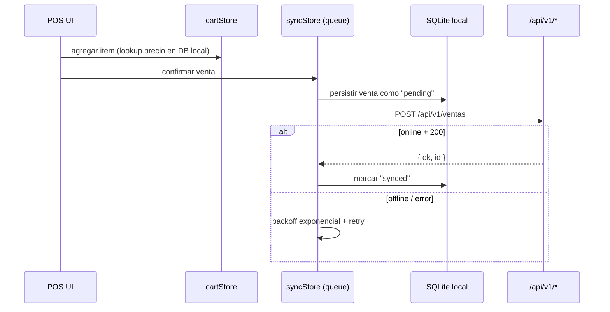

# Mobile — Expo SDK 54 + React Native 0.81

> **App:** `apps/mobile/`
> **Stack:** Expo SDK 54 · RN 0.81 · expo-router 6 · NativeWind 4.2.3
> · zustand · drizzle-orm + expo-sqlite · @tanstack/react-query

DyPos CL Mobile es un cliente nativo offline-first para cajeros. Habla con la
API REST `/api/v1/*` del web y cachea catálogo/ventas en SQLite local.

## 1. Estructura

```
apps/mobile/
├── app/                 # expo-router (file-based)
│   ├── (auth)/          # login, recover
│   ├── (tabs)/          # caja, ventas, productos, perfil
│   ├── _layout.tsx      # root nav + theme
│   ├── modal.tsx
│   └── index.tsx        # redirect inicial
├── stores/              # zustand
│   ├── authStore.ts     # JWT + user + rol
│   ├── cartStore.ts     # carrito en RAM (POS local)
│   └── syncStore.ts     # cola de mutaciones offline
├── db/                  # SQLite (drizzle)
│   ├── client.ts
│   ├── schema.ts
│   ├── productos-cache.ts
│   └── sync.ts
├── components/          # UI compartida (NativeWind)
├── hooks/
├── lib/
│   └── version.ts       # version-check vs /api/mobile/manifest
├── android/             # generated (expo prebuild)
├── scripts/
├── e2e/
└── __tests__/           # jest + jest-expo
```

## 2. Routing

`expo-router` 6 con file-based routing. Grupos `(auth)` y `(tabs)` separan
flujos. Stack root en `_layout.tsx` decide redirect según `authStore`.

## 3. Auth

- Login → `POST /api/v1/auth/login` retorna JWT.
- JWT guardado en `expo-secure-store` (cifrado por keystore Android / Keychain iOS).
- `authStore` (zustand) hidrata desde secure-store al boot.
- Cada request HTTP agrega `Authorization: Bearer <jwt>` vía `@repo/api-client`.
- Logout → secure-store clear + reset zustand.

## 4. Sync offline-first



`syncStore`:

- Cola FIFO de mutaciones (venta, devolución, movimiento caja).
- Backoff exponencial con jitter; max retries.
- NetInfo (`@react-native-community/netinfo`) para detectar reconexión.
- En foreground polling cada 30s; en background sólo al recuperar red.

`db/productos-cache.ts`:

- Pull periódico de `/api/v1/productos` (delta por `updatedAt`).
- TTL configurable; permite operar sin red para POS rápido.

## 5. UI / estilos

- **NativeWind 4.2.3** + `react-native-css-interop 0.2.3`.
- `tailwind.config.js` SÍ existe en mobile (NativeWind lo requiere; Tailwind v4 web no).
- `global.css` con `@tailwind` directives (NativeWind v4 patterns).
- Componentes en `components/` y `components/ui/` (variantes shadcn-like adaptadas).
- Animaciones: `react-native-reanimated` 4.1.x (gotcha SDK 54: `worklets` en babel).

## 6. Almacenamiento local

- `expo-sqlite` 16.x + `drizzle-orm` 0.45.x.
- Schema espejo simplificado: productos (cache), ventas-pending, movimientos-pending.
- Migrations drizzle aplicadas al boot (`drizzle-kit` no en runtime).

## 7. Build y release

- Dev: `pnpm --filter @repo/mobile start` o `expo run:android`.
- Release APK firmada: `scripts/mobile-build-apk.sh` (usa keystore generado por `mobile-generate-keystore.sh`).
- Publicación: `scripts/mobile-publish-release.sh` sube APK al VPS
  (`/var/www/apks/android/`) y registra en BD vía `/dashboard/mobile-releases`.
- Distribución: nginx vhost `apk-dypos.zgamersa.com` sirve `/var/www/apks/`.
- Manifest: `GET /api/mobile/manifest` retorna `{ version, url, sha256 }`.
- Version-check al boot: si `localVersion < remoteVersion` → modal "actualizar".

Detalle operativo en `docs/mobile-release-runbook.md` y
`docs/setup/nginx-apk-distribution.md`.

## 8. Tests

- Jest + `jest-expo` preset.
- `pnpm --filter @repo/mobile test:ci` en CI con `NODE_OPTIONS=--max-old-space-size=4096`
  (suites grandes con muchos mocks de jest-expo).
- E2E (carpeta `e2e/`) — pendiente formalizar con Detox o Maestro
  (`DECISION_REQUIRED`).

## 9. Pendientes / decisiones abiertas

- iOS build via EAS — no priorizado en MVP (solo Android).
- Push notifications (Expo Push) — `DECISION_REQUIRED`.
- OTA updates (expo-updates) — pendiente; hoy distribución manual de APK.

## 10. Gotchas activos (mobile)

| ID | Gotcha |
|----|--------|
| G-M47 | MIUI Security bloquea `adb install` — instalar manual desde Mi File Manager. |
| G-M51 | `git push` puede colgar — usar `GIT_TERMINAL_PROMPT=0 GIT_ASKPASS=true`. |
| G-M52 | `deploy.sh` con prompts: `printf 'n\ndeploy\n' | TERM=xterm-256color ./scripts/deploy.sh`. |
| ✦ | Mobile usa **JWT Bearer**, no cookies — aún cuando comparta secret. |
| ✦ | NativeWind v4.2 requiere `tailwind.config.js`; Tailwind web v4 no. Coexisten. |

## 11. Tareas Pierre vs agentes (mobile)

| Tarea | Quién |
|-------|-------|
| Generar keystore release | **Pierre** una sola vez (`mobile-generate-keystore.sh`) |
| Custodiar keystore + password | **Pierre** |
| Build + publish APK | Agentes con confirmación |
| Subir release a Google Play (futuro) | **Pierre** |
| Implementar features y tests | Agentes |
